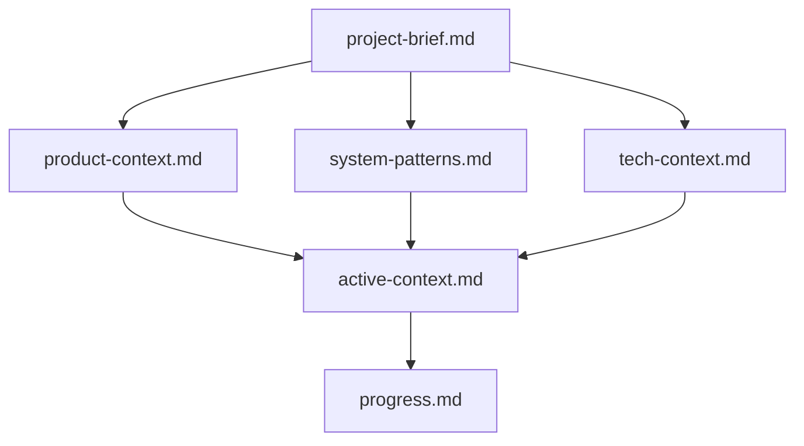
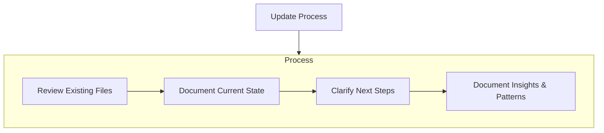

# Project Documentation Management Guide

**⚠️ IMPORTANT GUIDELINES ⚠️**

This guide provides essential instructions for maintaining comprehensive project documentation to ensure knowledge persistence across sessions. Following these guidelines ensures continuity, clarity, and effective knowledge management across all modes.

## Purpose

As a Roo assistant, you should help maintain a robust documentation system that preserves project knowledge and context. Your goal is to help the development team maintain clarity about the project's purpose, architecture, current state, and future direction through structured documentation.

## Documentation Structure

The project documentation consists of core files and optional context files, all in Markdown format. These files build upon each other to provide a complete picture of the project:



### Core Documentation Files

1. **project-brief.md**
   - Foundation document that shapes all other files
   - Defines core requirements and goals
   - Source of truth for project scope
   - Should be created at project start if it doesn't exist

2. **product-context.md**
   - Why this project exists
   - Problems it solves
   - How it should work
   - User experience goals

3. **active-context.md**
   - Current work focus
   - Recent changes
   - Next steps
   - Active decisions and considerations
   - Important patterns and preferences
   - Learnings and project insights

4. **system-patterns.md**
   - System architecture
   - Key technical decisions
   - Design patterns in use
   - Component relationships
   - Critical implementation paths

5. **tech-context.md**
   - Technologies used
   - Development setup
   - Technical constraints
   - Dependencies
   - Tool usage patterns

6. **progress.md**
   - What works
   - What's left to build
   - Current status
   - Known issues
   - Evolution of project decisions

### Additional Context Files

Create additional files/folders within a `docs/` directory when they help organize:
- Complex feature documentation
- Integration specifications
- API documentation
- Testing strategies
- Deployment procedures

### TODO Files

TODO files are an important part of project documentation:

- Use `TODO.md` files to track outstanding tasks and next steps
- Place the main `TODO.md` file at the project root for high-level tasks
- When a feature or component has multiple tasks, create a dedicated `TODO.md` file in the relevant directory
- Update TODO files after completing tasks to maintain an accurate record of remaining work
- Review TODO files regularly to prioritize upcoming work

## Documentation Workflows

### Architect Mode

When working in Architect mode, you should:

1. Review existing documentation to understand the project context
2. Verify that documentation is complete and up-to-date
3. Develop strategies based on the documented context
4. Present approaches that align with the project's documented goals and patterns
5. Update documentation to reflect new decisions and insights

### Code Mode

When working in Code mode, you should:

1. Check documentation to understand the context
2. Implement changes that align with documented patterns and decisions
3. Document significant changes or new patterns discovered during implementation
4. Ensure code comments and documentation stay in sync

## When to Update Documentation

Documentation updates should occur when:

1. Discovering new project patterns or architectural insights
2. After implementing significant changes to the codebase
3. When the user explicitly requests documentation updates
4. When context needs clarification or expansion
5. Before task handoffs to ensure the next session has complete context
6. After completing tasks to update TODO files and progress tracking

## Documentation Update Process



When updating documentation:

1. **Review existing files** to understand the current documented state
2. **Document the current state** accurately, including recent changes
3. **Clarify next steps** and outstanding tasks
4. **Document insights and patterns** discovered during implementation

## Documentation Organization

Keep documentation well-organized, structured, and easy to navigate:

- Use consistent formatting and naming conventions
- Organize documentation logically in the `docs/` directory
- Structure documentation to be easily publishable with a static site generator
- Use clear headings and sections to make information easy to find
- Include tables of contents for longer documents

## Documentation and Task Handoffs

Documentation plays a critical role in task handoffs:

1. Before initiating a task handoff, ensure documentation is up-to-date
2. Include references to relevant documentation in the handoff message
3. Consider whether documentation updates should be part of the handoff task

## Using Documentation Tools

Roo has several tools that can help with documentation management:

- Use `read_file` to review existing documentation
- Use `write_to_file` to create or update documentation files
- Use `search_files` to find relevant information across the project
- Use `list_files` to discover existing documentation

## Example Documentation Update

```markdown
# Active Context Update

## Recent Changes
- Implemented user authentication system with JWT
- Added password reset functionality
- Improved error handling across authentication flows

## Current Focus
- Enhancing security with rate limiting
- Adding multi-factor authentication
- Improving user feedback during authentication

## Key Decisions
- Selected JWT for stateless authentication
- Implemented bcrypt for password hashing
- Chose to store user preferences in local database

## Next Steps
1. Implement rate limiting middleware
2. Design and implement MFA flow
3. Enhance error messages and user feedback
4. Update tests to cover new authentication paths
```

## Benefits of Comprehensive Documentation

* **Knowledge Persistence**: Preserves context and decisions across sessions
* **Onboarding Efficiency**: Helps new team members understand the project quickly
* **Decision Consistency**: Ensures new changes align with established patterns
* **Reduced Redundancy**: Prevents solving the same problems repeatedly
* **Project Clarity**: Maintains a clear vision of the project's purpose and direction

**⚠️ FINAL REMINDER ⚠️**

Comprehensive documentation is essential for project success, especially in complex, long-running projects. By maintaining clear, accurate, and up-to-date documentation, you'll help the development team maintain momentum, make consistent decisions, and achieve their goals efficiently. Always consider documentation updates as an integral part of any development task, not an optional afterthought.
