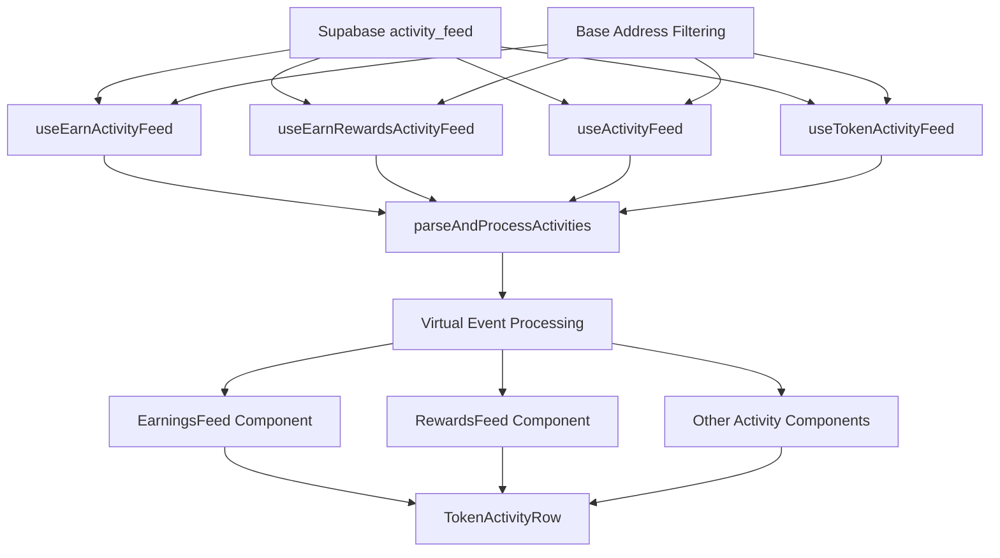

# Send App Activity Feed

This document provides an overview of the activity feed system in the Send App, with a focus on the base address filtering functionality and its integration with different activity feeds.

## Table of Contents

1. [Overview](#overview)
2. [Base Address Filtering](#base-address-filtering)
3. [Activity Feed Architecture](#activity-feed-architecture)
4. [Send Earn Activity Feed](#send-earn-activity-feed)
5. [Related Documentation](#related-documentation)

## Overview

The activity feed displays a chronological list of user activities within the Send App, such as transfers, deposits, withdrawals, and other events. The system consists of several components:

1. **Database Layer**: A Supabase view (`activity_feed`) that aggregates events from various tables
2. **Data Fetching Layer**: React Query hooks that fetch and paginate the activity data
3. **Processing Layer**: Client-side functions that analyze and potentially modify the event data
4. **Display Layer**: React components that render the processed activities

While most events can be directly mapped from their database representation to a user-friendly display, some events require additional context to be correctly classified. For example, a `send_account_transfer` event that transfers tokens to a Send Earn vault should be displayed as a "Send Earn Deposit" rather than a generic "Withdraw".

## Base Address Filtering

One important aspect of the activity feed system is the base address filtering functionality, which filters out system addresses like paymasters and lockboxes from activity displays. This is implemented in the `getBaseAddressFilterCondition` function in `packages/app/utils/activity.ts`:

```typescript
/**
 * Creates base filtering conditions for activity feed queries to exclude system addresses
 * like paymasters that should be filtered from activity displays.
 *
 * @param customFromIgnore - Additional addresses to ignore in 'from' field
 * @param customToIgnore - Additional addresses to ignore in 'to' field
 * @returns SQL condition string for use in Supabase queries
 */
export function getBaseAddressFilterCondition(
  customFromIgnore: `0x${string}`[] = [],
  customToIgnore: `0x${string}`[] = []
): string {
  const paymasterAddresses = Object.values(tokenPaymasterAddress)
  const sendTokenV0LockboxAddresses = Object.values(sendTokenV0LockboxAddress)

  // Base addresses to ignore in 'from' field
  const fromIgnoreAddresses = [
    ...paymasterAddresses, // show fees on send screen instead
    ...customFromIgnore,
  ]

  // Base addresses to ignore in 'to' field
  const toIgnoreAddresses = [
    ...paymasterAddresses, // show fees on send screen instead
    ...sendTokenV0LockboxAddresses, // will instead show the "mint"
    ...customToIgnore,
  ]

  const fromTransferIgnoreValues = pgAddrCondValues(fromIgnoreAddresses)
  const toTransferIgnoreValues = pgAddrCondValues(toIgnoreAddresses)

  return squish(`
    data->t.is.null,
    data->f.is.null,
    and(
      data->>t.not.in.(${toTransferIgnoreValues}),
      data->>f.not.in.(${fromTransferIgnoreValues})
    )
  `)
}
```

This function creates SQL conditions that can be used in Supabase queries to filter out system addresses from activity displays. It takes two optional parameters:

- `customFromIgnore`: Additional addresses to ignore in the 'from' field
- `customToIgnore`: Additional addresses to ignore in the 'to' field

By default, it filters out:

- **Paymaster addresses** from both 'from' and 'to' fields (fees are shown on the send screen instead)
- **SendTokenV0Lockbox addresses** from the 'to' field (these will instead show as "mint" events)

The function returns a SQL condition string that can be used in Supabase queries with the `.or()` method to filter out these system addresses.

## Activity Feed Architecture

The activity feed system is designed to be modular and extensible, with different hooks for different types of activity feeds:

1. **useTokenActivityFeed**: For general token activity
2. **useEarnActivityFeed**: For Send Earn activity
3. **useEarnRewardsActivityFeed**: For Send Earn rewards activity

All of these hooks use the base address filtering functionality to filter out system addresses from activity displays. They also use the client-side processing layer to identify special cases like Send Earn deposits and withdrawals.

Here's how the base address filtering is used in the `useTokenActivityFeed` hook:

```typescript
const { data, error } = await query
  .or('from_user.not.is.null, to_user.not.is.null') // only show activities with a send app user
  .or(getBaseAddressFilterCondition())
  .order('created_at', { ascending: false })
  .range(from, to)
```

And here's how it's used in the `useEarnActivityFeed` hook:

```typescript
const query = supabase
  .from('activity_feed')
  .select('*')
  .eq('event_name', DatabaseEvents.SendAccountTransfers)
  .or(
    squish(`
      data->>f.eq.${userAddressBytea},data->>t.in.(${vaultAddressesValues}),
      data->>t.eq.${userAddressBytea},data->>f.in.(${vaultAddressesValues})
    `)
  )
  // Apply base address filtering
  .or(getBaseAddressFilterCondition())
  .order('created_at', { ascending: false })
  .range(from, to)
```

## Send Earn Activity Feed

The Send Earn activity feed uses the existing client-side activity feed system, which now supports virtual events. This allows for a more consistent user experience across all activity feeds.

The Send Earn activity feed is implemented in the `useEarnActivityFeed` hook in `packages/app/features/earn/utils/useEarnActivityFeed.ts`. This hook:

1. Fetches Send Earn activities from the `activity_feed` view
2. Applies base address filtering to exclude system addresses
3. Uses client-side processing to identify Send Earn deposits and withdrawals
4. Returns the processed activities for display

Here's how the Send Earn activity feed is implemented:

```typescript
/**
 * Infinite query to fetch Send Earn activity feed.
 * Uses the client-side processing to identify Send Earn deposits and withdrawals.
 *
 * @param params.pageSize - Number of items to fetch per page
 * @param params.refetchInterval - Interval in ms to refetch data
 * @param params.enabled - Whether the query is enabled
 */
export function useEarnActivityFeed(params?: {
  pageSize?: number
  refetchInterval?: number
  enabled?: boolean
}): UseInfiniteQueryResult<InfiniteData<Activity[]>, PostgrestError | ZodError> {
  // ... implementation details ...

  return useInfiniteQuery({
    // ... configuration ...
    queryFn: async ({ queryKey: [, { addressBook, supabase, pageSize, sendAccount }], pageParam }) => {
      // ... validation ...

      return await fetchEarnActivityFeed({
        pageParam,
        supabase,
        pageSize,
        addressBook: addressBook.data,
        userAddress: sendAccount.data.address,
      })
    },
  })
}

/**
 * Fetches the Send Earn activity feed for the current user.
 * This queries the activity_feed view with filters to identify Send Earn related activities.
 */
async function fetchEarnActivityFeed({
  pageParam,
  addressBook,
  supabase,
  pageSize,
  userAddress,
}: {
  pageParam: number
  addressBook: AddressBook
  supabase: SupabaseClient<Database>
  pageSize: number
  userAddress: `0x${string}`
}): Promise<Activity[]> {
  // ... implementation details ...

  // Query for transfers to/from Send Earn vaults involving the user
  const query = supabase
    .from('activity_feed')
    .select('*')
    .eq('event_name', DatabaseEvents.SendAccountTransfers)
    .or(
      squish(`
        data->>f.eq.${userAddressBytea},data->>t.in.(${vaultAddressesValues}),
        data->>t.eq.${userAddressBytea},data->>f.in.(${vaultAddressesValues})
      `)
    )
    // Apply base address filtering
    .or(getBaseAddressFilterCondition())
    .order('created_at', { ascending: false })
    .range(from, to)

  const { data, error } = await query
  throwIf(error)

  // Parse and process the raw data
  return parseAndProcessActivities(data, {
    addressBook,
  })
}
```

The key aspects of this implementation are:

1. It uses the `getBaseAddressFilterCondition()` function to filter out system addresses
2. It identifies Send Earn vaults in the address book and filters for transfers to/from these vaults
3. It uses the `parseAndProcessActivities()` function to process the raw data and identify virtual events

## Related Documentation

For more information on the activity feed system, see the following documents:

- [Activity Feed Client-Side Processing](./activity-feed-client-processing.md): Detailed information on the client-side processing layer that enables virtual event types
- [Send App Activity Feed Database Design](./send-app-activity-feed.md): Information on the database design for the activity feed

## Diagram of the Activity Feed Architecture



This diagram illustrates how the different components of the activity feed system work together, with the base address filtering applied to all activity feed queries and the client-side processing layer identifying virtual events.
