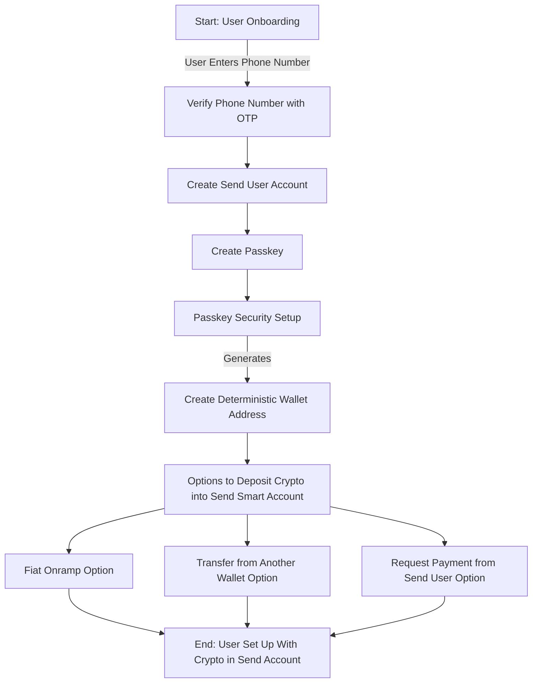

# Send App Onboarding

Send is a mobile app that allows users to send and receive crypto payments. It is built on top of the Send Smart Account:

- buy, sell, send, and spend Ethereum
- self-custodial onchain payments (tap to pay)
- custody of $ETH, $USDT, $USDC, and $SEND only
- p2p transfers by way of Sendtags not addresses

## Getting Started

User enters phone number to get started, and verifies their phone number with a OTP code sent via SMS. A Send user is then created with the phone number, and the user is logged in.

User then must create a passkey which is used as the main signer for ther Send Smart Account contract.

> Passkeys are based on public key cryptography, which matches a private key saved on a device with a public key sent to a web server. When someone signs in to an account, their private key is verified by your app or website’s public key. That private key never leaves their device, so apps and websites never have access to it — and can’t lose it or reveal it in a hacking or phishing attempt. There’s nothing secret about the public key; it offers no access to anything until paired with the private key.

Read more about passkeys [here](https://developer.apple.com/news/?id=21mnmxow).

Once a passkey is created, a deterministic wallet address is created from the passkey. This is the address of their Send Smart Account contract.

-----

```md
At this point, we need to get the user crypto into their Send Smart Account contract. A couple of options here:

1. A fiat onramp (e.g. Coinbase, ZKp2p)
2. Transfer from another wallet
3. Request payment from another Send user

For the MVP, we'll assume the user has crypto in another wallet, and will transfer it to their Send Smart Account contract.
```

-----


