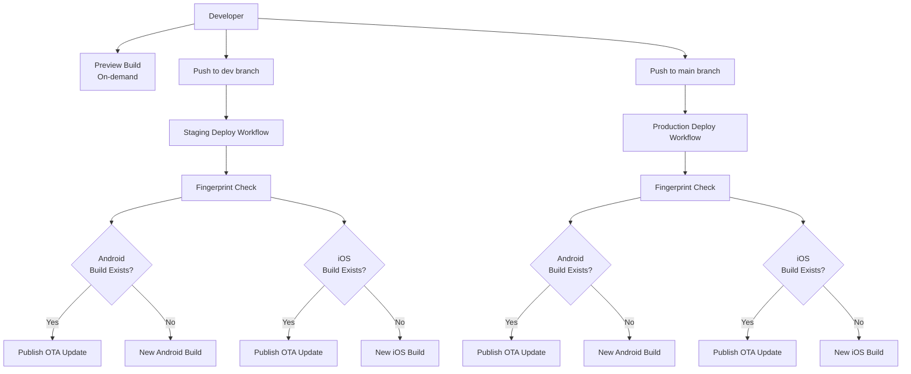

# Expo App Deployment

This document describes the deployment flow for the Send mobile app built with Expo.

## Deployment Flow Diagram



## Environments

| Environment | Branch | Build Profile | Update Channel |
|-------------|--------|---------------|----------------|
| Staging     | `dev`  | staging       | staging        |
| Production  | `main` | production    | production     |

## Automated Deployments

### Staging (dev branch)

Triggered automatically on every push to `dev`:

1. **Fingerprint** - Generates a unique hash based on native code changes
2. **Check Existing Builds** - Looks for Android/iOS builds matching the fingerprint
3. **Build or Update**:
   - **Build exists**: Publishes OTA update via `eas update`
   - **No build**: Creates new native build via `eas build`

### Production (main branch)

Triggered automatically on every push to `main`:

Same flow as staging but targets the production profile and channel.

## On-Demand Preview Builds

Developers can build preview versions locally to test changes before merging to `dev`.

### Available Scripts

From `apps/expo/`:

```bash
# Android preview build
yarn eas:build:preview:android

# iOS preview build
yarn eas:build:preview:ios
```

### When to Use Preview Builds

- Testing native code changes before merging
- QA verification of specific features
- Debugging platform-specific issues
- Sharing builds with team members for review

## Build Profiles

| Profile     | Purpose                                    |
|-------------|--------------------------------------------|
| development | Local development with dev client          |
| preview     | On-demand testing builds                   |
| staging     | Automated builds from dev branch           |
| production  | Automated builds from main branch          |

## OTA Updates vs Native Builds

The workflow uses **fingerprinting** to determine whether a native rebuild is needed:

- **OTA Update**: JavaScript/asset changes only - fast, no app store submission
- **Native Build**: Native code changes - requires new binary build

This optimization reduces build times and costs when only JS changes are deployed.

## Fingerprint-Affecting Changes

When your changes affect the native fingerprint, a new binary build is triggered. In this case, you **must bump the app version** in both files:

- `apps/expo/package.json` → `version` field
- `apps/expo/app.config.ts` → `version` field

### Examples of Fingerprint-Affecting Changes

| Change Type | Examples |
|-------------|----------|
| Native dependencies | Adding/updating `react-native-*` packages, Expo SDK upgrades |
| Expo plugins | Adding/modifying plugins in `app.config.ts` |
| Native config | Changing `ios.infoPlist`, `android.permissions`, build properties |
| Native code | Modifying files in `ios/` or `android/` directories |
| Assets referenced in config | Changing app icons, splash screens |
| Build settings | SDK versions, deployment targets, architecture flags |

### Changes That Do NOT Affect Fingerprint

- JavaScript/TypeScript code changes
- React component updates
- Style changes
- Adding/updating JS-only dependencies
- Asset changes not referenced in native config

### Versioning Guidelines (Semver)

Follow semantic versioning (`MAJOR.MINOR.PATCH`):

| Version Bump | When to Use | Example |
|--------------|-------------|---------|
| **PATCH** (1.1.1 → 1.1.2) | Bug fixes, minor native dependency updates | Fixing a crash, updating a patch version of a native lib |
| **MINOR** (1.1.1 → 1.2.0) | New features requiring native changes | Adding a new Expo plugin, new permissions |
| **MAJOR** (1.1.1 → 2.0.0) | Breaking changes, major SDK upgrades | Expo SDK major version upgrade, architecture changes |

### Version Bump Checklist

When making fingerprint-affecting changes:

1. Update version in `apps/expo/package.json`
2. Update version in `apps/expo/app.config.ts` (must match)
3. Commit both files together with your native changes
