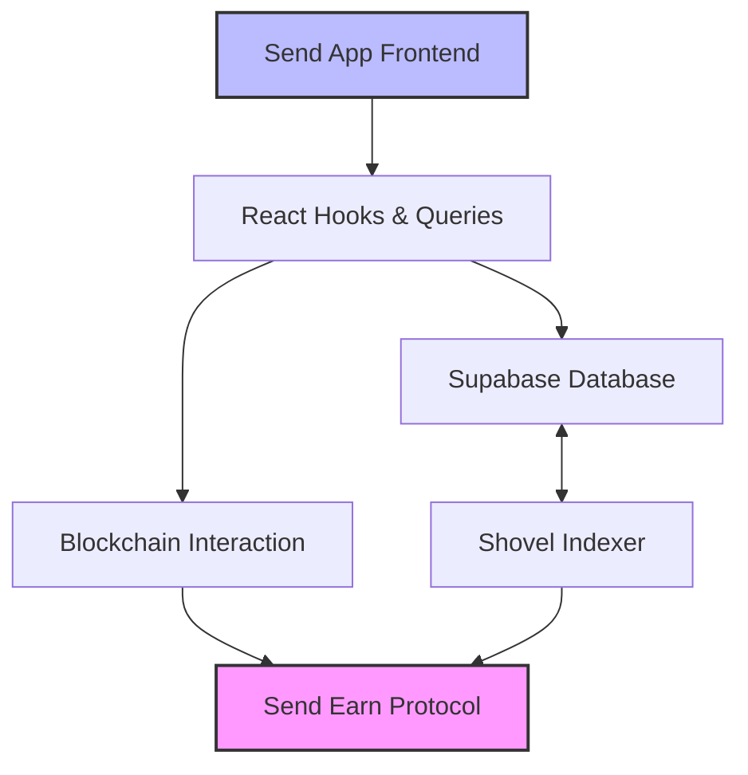
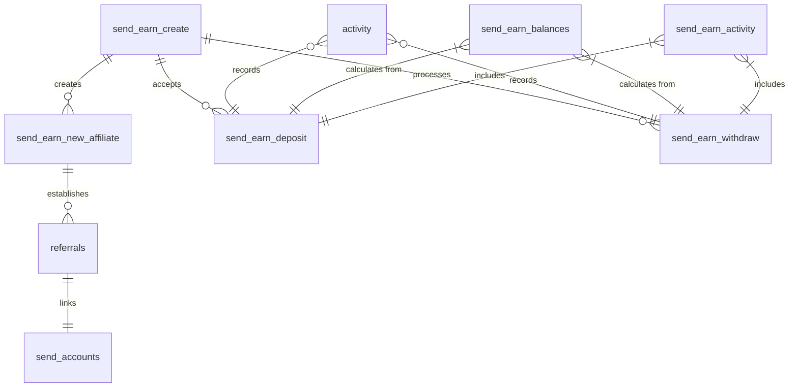
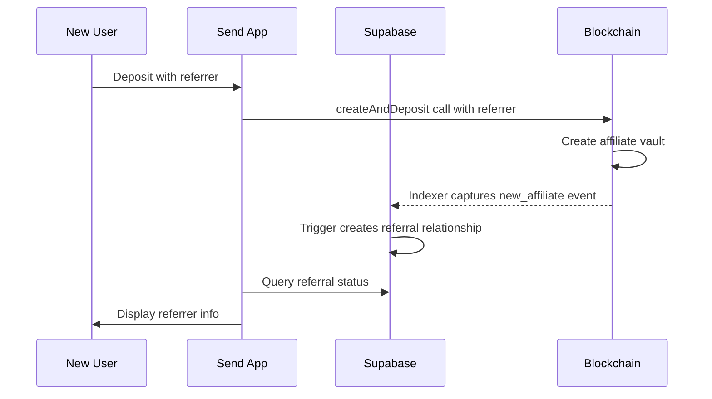

# Send App Integration with Send Earn Protocol

This document outlines how the Send App integrates with the Send Earn protocol, a permissionless, non-custodial yield-generating protocol built on MetaMorpho.

## 1. Architecture Overview

Send App's integration with the Send Earn protocol follows a layered architecture that connects user interactions in the frontend to blockchain operations through a series of middlewares and services.



### Key Components:

1. **Frontend Layer**: React-based UI components and screens for deposit, withdraw, and viewing earnings
2. **Data Access Layer**: React Query hooks for data fetching, caching, and state management
3. **Database Layer**: Supabase tables and views tracking onchain events and user relationships
4. **Blockchain Layer**: UserOp-based transaction system for interacting with smart contracts
5. **Indexing System**: Shovel indexer that captures blockchain events and populates the database

## 2. Database Integration

Send App uses Supabase as its database backend, with several custom tables and triggers to track Send Earn events and activities.

### Schema Design:



### Key Tables:

1. **send_earn_create**: Records the creation of Send Earn vaults
   - Stores vault address, fee configuration, and creator information
   - Links to protocol and platform accounts

2. **send_earn_new_affiliate**: Tracks new affiliate relationships
   - Connects user accounts to their Send Earn affiliate contracts
   - Used to resolve referral relationships

3. **send_earn_deposit**: Records user deposits into Send Earn vaults
   - Tracks amount, shares, and transaction details
   - Creates activity feed entries via database triggers

4. **send_earn_withdraw**: Records user withdrawals from Send Earn vaults
   - Tracks amount, shares, and transaction details
   - Creates activity feed entries via database triggers

5. **referrals**: Stores referrer-referred relationships
   - Populated automatically by database triggers on deposit and new affiliate events
   - Used to track multi-level referral chains

### Views and Computed Data:

1. **send_earn_balances**: Computed view showing user balances by vault
   - Aggregates deposits and withdrawals to calculate current balances
   - Used by the frontend to display user holdings

2. **send_earn_activity**: View combining deposit and withdrawal activities
   - Provides a chronological history of user actions
   - Used for the activity feed and transaction history

### Database Triggers:

The integration includes several database triggers ([defined in migrations like this one](../supabase/migrations/20250401044160_send_earn.sql)) that perform automatic actions:

1. **`aaa_filter_send_earn_deposit_with_no_send_account_created`**: Filters out deposits from non-Send accounts
2. **`aab_send_earn_deposit_trigger_insert_activity`**: Creates activity entries for deposits
3. **`aaa_send_earn_deposit_trigger_delete_activity`**: Removes activity entries when deposits are deleted
4. **`aab_temporal_deposit_update_activity_on_status_change`**: Updates the initial 'pending' activity record to 'failed' if the corresponding Temporal workflow fails, including the error message.
5. **`insert_referral_on_deposit`**: Automatically creates referral relationships when deposits are made
6. **`insert_referral_on_new_affiliate`**: Creates referral relationships when new affiliates are created

## 3. Frontend Implementation

The frontend implementation provides users with intuitive interfaces for interacting with the Send Earn protocol.

### Key Screens:

1. **Deposit Screen**: Allows users to deposit USDC into Send Earn vaults
   - Amount input with balance display
   - APY and earnings calculator
   - Terms acceptance and submission logic

2. **Withdraw Screen**: Enables users to withdraw their funds
   - Amount selection with available balance check
   - Transaction confirmation and submission

3. **Earnings Screen**: Displays current balances and earnings
   - Current deposit amount
   - Accrued interest
   - APY information
   - Referral earnings

### Component Structure:

```
features/earn/
├── components/              # Shared components
│   ├── [SendEarnAmount.tsx](../packages/app/features/earn/components/SendEarnAmount.tsx)   # Amount input component
│   ├── [CalculatedBenefits.tsx](../packages/app/features/earn/components/CalculatedBenefits.tsx) # APY and earnings display
│   └── [EarnTerms.tsx](../packages/app/features/earn/components/EarnTerms.tsx)        # Terms and conditions component
├── deposit/                 # Deposit flow
│   ├── [screen.tsx](../packages/app/features/earn/deposit/screen.tsx)           # Main deposit screen
│   └── [hooks/](../packages/app/features/earn/deposit/hooks/index.ts)               # Deposit-specific hooks
├── withdraw/                # Withdraw flow
│   ├── [screen.tsx](../packages/app/features/earn/withdraw/screen.tsx)           # Main withdraw screen
│   └── hooks/               # Withdraw-specific hooks
├── earnings/                # Earnings display
│   └── [screen.tsx](../packages/app/features/earn/earnings/screen.tsx)           # Main earnings screen
├── [hooks/](../packages/app/features/earn/hooks/index.ts)                   # Shared hooks
│   └── index.ts             # Common hooks for Send Earn
└── utils/                   # Utility functions
    └── [useEarnActivityFeed.ts](../packages/app/features/earn/utils/useEarnActivityFeed.ts) # Activity feed for earnings
```

### State Management:

Send App uses React Query for state management, with [custom hooks](../packages/app/features/earn/hooks/index.ts) that:

1. **Fetch onchain data**: APY rates, current balances, and protocol state
2. **Query database**: User balances, activity history, and referral information
3. **Prepare transactions**: Create and sign UserOps for deposits and withdrawals
4. **Track transaction state**: Monitor pending transactions and update UI accordingly

## 4. Blockchain Interaction

Send App interacts with the Send Earn protocol through Account Abstraction and UserOps.

### UserOp System:

1. **Transaction Preparation**:
   - The app prepares transactions using [`useSendEarnDepositCalls`](../packages/app/features/earn/deposit/hooks/index.ts) or `useSendEarnWithdrawCalls`
   - These hooks generate the necessary contract calls based on user actions

2. **Signature Process**:
   - Transactions are signed using WebAuthn credentials
   - The [`signUserOp`](../packages/workflows/src/utils/userop.ts) utility handles the signature process

3. **Transaction Submission**:
   - Signed UserOps are submitted to a bundler
   - The app monitors transaction status and updates UI accordingly

### Vault Selection Logic:

The app implements smart vault selection logic:

1. For deposits:
   - If the user has existing deposits, use their current vault
   - If the user was referred, use the referrer's affiliate vault
   - Otherwise, create a new vault through the factory

2. For withdrawals:
   - Find the vault with a balance for the requested asset
   - Generate withdrawal calls for that vault

### Contract Interaction Patterns:

The app interacts with three main contracts:

1. **Send Earn Factory (SEF)**:
   - Creates new vaults and affiliate contracts
   - Manages deposit routing for new users

2. **Send Earn Vault (SEV)**:
   - Handles direct deposits and withdrawals
   - Manages yield accrual and fee distributions

3. **ERC20 Tokens (USDC)**:
   - Approves token transfers before deposits
   - Receives tokens during withdrawals

## 5. Deposit Workflow Orchestration (Temporal)

While the frontend prepares and signs the UserOperation (UserOp) for a deposit, the actual submission, monitoring, and confirmation process is managed by a Temporal workflow to ensure resilience and observability. This is crucial because UserOps involve multiple steps (bundling, blockchain confirmation, indexing) that can take time and potentially fail.

### Purpose

Using Temporal for deposit orchestration provides several benefits:
- **Reliability:** Handles transient errors (e.g., network issues, bundler downtime) with built-in retries.
- **State Management:** Tracks the precise state of each deposit UserOp throughout its lifecycle.
- **Observability:** Offers visibility into the workflow progress and any failures.
- **Consistency:** Ensures that the final state in the public database tables accurately reflects the onchain outcome.

### Components

1.  **[`DepositWorkflow`](../packages/workflows/src/deposit-workflow/workflow.ts)**: The main Temporal workflow orchestrating the deposit process. It's typically initiated by the backend API after receiving a signed UserOp from the client.
2.  **[Temporal Activities](../packages/workflows/src/deposit-workflow/activities.ts)**: Discrete units of work executed by the workflow:
    *   `upsertTemporalDepositActivity`: Creates or updates the initial record in the tracking table.
    *   `simulateDepositActivity`: Simulates the UserOp against the bundler to catch potential issues before submission.
    *   `updateTemporalDepositActivity`: Updates the status and details of the deposit in the tracking table at various stages.
    *   `waitForTransactionReceiptActivity`: Polls the blockchain for the transaction receipt once the UserOp is submitted.
    *   `verifyDepositIndexedActivity`: Polls the public database table (`public.send_earn_deposit`) to confirm the event has been successfully indexed by Shovel.
3.  **[`temporal.send_earn_deposits` Table](../supabase/migrations/20250401044160_send_earn.sql)**: A dedicated Supabase table within the `temporal` schema used by the workflow to track the intermediate state of each deposit (e.g., `initiated`, `simulated`, `submitted`, `sent`, `mined`, `indexed`, `failed`). This table mirrors the structure of `public.send_earn_deposit` but includes additional status fields for workflow management.

### Workflow Steps

The typical sequence orchestrated by the `sendEarnDepositWorkflow` is as follows:

```mermaid
sequenceDiagram
    participant Client as Send App Client
    participant API as Send App API/Backend
    participant TemporalWF as Temporal Workflow
    participant TemporalActivity as Temporal Activities
    participant DB_Temporal as temporal.send_earn_deposits
    participant Bundler as UserOp Bundler
    participant BC as Blockchain
    participant Indexer as Shovel Indexer
    participant DB_Public as public.send_earn_deposit
    participant DB_Activity as public.activity

    Client->>API: Initiate Deposit (UserOp Signed)
    API->>TemporalWF: Start sendEarnDepositWorkflow
    TemporalWF->>TemporalActivity: upsertTemporalDepositActivity (status: initiated)
    TemporalActivity->>DB_Temporal: Upsert Record (triggers creation of initial 'pending' activity in DB_Activity)
    TemporalWF->>TemporalActivity: simulateDepositActivity
    TemporalActivity->>Bundler: Simulate UserOp
    TemporalActivity-->>TemporalWF: Simulation Result
    TemporalWF->>TemporalActivity: updateTemporalDepositActivity (status: simulated)
    TemporalActivity->>DB_Temporal: Update Record
    TemporalWF->>Bundler: Submit UserOp
    TemporalWF->>TemporalActivity: updateTemporalDepositActivity (status: submitted)
    TemporalActivity->>DB_Temporal: Update Record
    Bundler-->>TemporalWF: UserOp Hash
    TemporalWF->>TemporalActivity: updateTemporalDepositActivity (status: sent, userOpHash)
    TemporalActivity->>DB_Temporal: Update Record
    TemporalWF->>TemporalActivity: waitForTransactionReceiptActivity (polling BC)
    TemporalActivity->>BC: Get Transaction Receipt
    BC-->>TemporalActivity: Receipt
    TemporalActivity-->>TemporalWF: Receipt Received
    TemporalWF->>TemporalActivity: updateTemporalDepositActivity (status: mined, txHash)
    TemporalActivity->>DB_Temporal: Update Record
    TemporalWF->>TemporalActivity: verifyDepositIndexedActivity (polling DB_Public)
    Note right of Indexer: Indexer processes BC event<br/>and writes to DB_Public
    TemporalActivity->>DB_Public: Query for indexed record
    DB_Public-->>TemporalActivity: Record Found
    TemporalActivity-->>TemporalWF: Indexing Verified
    TemporalWF->>TemporalActivity: updateTemporalDepositActivity (status: indexed)
    TemporalActivity->>DB_Temporal: Update Record

    alt On Error
        TemporalWF->>TemporalActivity: updateTemporalDepositActivity (status: failed)
        TemporalActivity->>DB_Temporal: Update Record
    alt On Error (e.g., simulation, submission, mining)
        TemporalWF->>TemporalActivity: updateTemporalDepositActivity (status: failed, error_message)
        TemporalActivity->>DB_Temporal: Update Record (triggers update of linked activity in DB_Activity to 'failed')
    end
```

This workflow ensures that the deposit is tracked end-to-end, from submission to final confirmation in the application's public database tables (`public.send_earn_deposit` for success, `public.activity` for both success and failure), handling potential failures along the way. The `temporal.send_earn_deposits` table acts as the source of truth for the workflow's state, and triggers ensure this state is reflected appropriately in the user-facing activity feed.

## 6. Referral System Implementation

The referral system is a key feature of Send App's integration with Send Earn.

### Referral Tracking:



### Implementation Components:

1. **[`useReferrer` and `useReferredBy` Hooks](../packages/app/features/earn/hooks/index.ts)**:
   - Track referral relationships in both directions
   - Used to display referral information and calculate earnings

2. **`ReferredBy` Component**:
   - Displays the user's referrer in the UI
   - Shows during the deposit flow

3. **[`useSendEarnDepositVault` Hook](../packages/app/features/earn/deposit/hooks/index.ts)**:
   - Determines the appropriate vault based on referral status
   - Prioritizes existing deposits, then referrer relationships

4. **[Database Triggers](../supabase/migrations/20250401044160_send_earn.sql)**:
   - Automatically create referral relationships from onchain events (`insert_referral_on_deposit`, `insert_referral_on_new_affiliate`)
   - Track both direct and multi-level referrals

### Multi-Level Referrals:

The system supports multi-level referrals where:

1. User A refers User B
2. User B refers User C
3. When User C deposits:
   - User B earns referral fees
   - User B's earnings are deposited to User A's affiliate vault
   - This creates a chain of revenue sharing

## 7. Activity Feed Integration

Send Earn activities are integrated into the main Send App activity feed.

### Event Tracking:

1. **Deposit and Withdraw Events**:
   - Captured from blockchain by the Shovel indexer
   - Stored in dedicated tables with transaction details

2. **Database Triggers**:
   - Convert raw blockchain events into user-friendly activity records
   - Link activities to user accounts for permission control

3. **Activity Feed Queries**:
   - [`useEarnActivityFeed`](../packages/app/features/earn/utils/useEarnActivityFeed.ts) hook fetches Send Earn activities
   - Integrates with the main activity feed system

### Implementation Details:

1. **[Trigger Functions](../supabase/migrations/20250401044160_send_earn.sql)**:
   - `aab_send_earn_deposit_trigger_insert_activity`: Creates activity entries for deposits
   - `aab_send_earn_withdraw_trigger_insert_activity`: Creates activity entries for withdrawals
   - `aab_temporal_deposit_update_activity_on_status_change`: Updates activity entries for failed deposits (initiated via Temporal)

2. **Activity States**:
   - Successful deposits and withdrawals appear as distinct events.
   - Failed deposit attempts (orchestrated via Temporal) also appear in the feed, marked with a 'failed' status and including the specific error message encountered during the workflow.

3. **Data Transformation**:
   - Raw blockchain data and Temporal workflow outcomes are transformed into user-friendly formats.
   - Includes human-readable amounts, timestamps, and transaction references

3. **UI Components**:
   - Activities appear in the main feed with appropriate icons and descriptions
   - Users can view transaction details and follow links to related screens

## Conclusion

The Send App integration with the Send Earn protocol creates a seamless user experience for depositing, earning yield, and participating in the referral program. Through a combination of database schema design, frontend components, and blockchain interactions, the app provides users with a full-featured interface to the protocol's capabilities.

The integration leverages Account Abstraction for simplified transactions, database triggers for automatic referral tracking, and React Query for efficient state management. This approach balances onchain security with off-chain user experience to create a robust DeFi application.
