# Send App - System Architecture Diagram

## High-Level Architecture

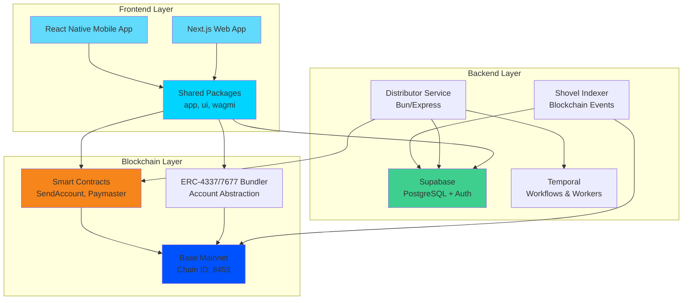

## Component Breakdown

### Frontend Layer

#### 1. Next.js Web App (`/apps/next`)

**Purpose**: Web interface for Send payments platform

**Technologies**:

- Next.js 15+ with App Router
- React Server Components
- Tamagui for styling
- Wagmi for blockchain interactions

**Key Features**:

- Server-side rendering for optimal SEO
- Static generation for marketing pages
- Dynamic routes for user profiles and transactions
- API routes for server-side operations

**Integration Points**:

- Supabase Auth for authentication
- tRPC APIs for backend communication
- Wagmi hooks for smart contract interactions
- WebSocket subscriptions for real-time updates

**File Structure**:

```
apps/next/
├── app/                 # Next.js app directory
├── public/              # Static assets
├── components/          # Web-specific components
└── utils/               # Web-specific utilities
```

---

#### 2. React Native Mobile App (`/apps/expo`)

**Purpose**: Native mobile application for iOS and Android

**Technologies**:

- Expo SDK
- React Native
- Expo Router for navigation
- Tamagui for cross-platform UI

**Key Features**:

- Biometric authentication (Face ID, Touch ID)
- Camera integration for QR code scanning
- Push notifications for transaction alerts
- Secure storage for sensitive data

**Integration Points**:

- Shared business logic from `packages/app`
- Native modules for device features
- WebAuthn for authentication
- Same backend APIs as web app

**File Structure**:

```
apps/expo/
├── app/                 # Expo Router screens
├── assets/              # Images, fonts, icons
├── components/          # Mobile-specific components
└── utils/               # Mobile-specific utilities
```

---

#### 3. Shared Packages (`/packages`)

##### packages/app

**Purpose**: Core business logic and screens shared between web and mobile

**Contains**:

- Screen components (Home, Send, Activity, Profile)
- Business logic and state management
- Data fetching hooks (React Query)
- Navigation structure (Solito)

**Platform Handling**:

```typescript
// Base component (web default)
ComponentName.tsx

// Native override
ComponentName.native.tsx
```

##### packages/ui

**Purpose**: Reusable UI component library built on Tamagui

**Contains**:

- Button, Input, Card, Modal components
- Theme configuration (colors, spacing, typography)
- Responsive layout utilities
- Custom styled components

**Example**:

```typescript
import { Button, Card, Text } from '@my/ui'

export function PaymentCard() {
  return (
    <Card>
      <Text>Send Payment</Text>
      <Button>Confirm</Button>
    </Card>
  )
}
```

##### packages/wagmi

**Purpose**: Blockchain integration layer

**Contains**:

- Smart contract hooks (useSendAccount, usePaymaster)
- Wagmi configuration and chains
- Contract ABIs and type definitions
- Transaction helpers

**Example**:

```typescript
import { useSendAccount } from '@my/wagmi'

export function SendPayment() {
  const { send, isLoading } = useSendAccount()

  const handleSend = async () => {
    await send({
      to: '0x...',
      amount: '100',
      token: 'USDC',
    })
  }
}
```

---

### Backend Layer

#### 4. Supabase (`/supabase`)

**Purpose**: PostgreSQL database, authentication, and real-time subscriptions

**Components**:

- **PostgreSQL Database**: Core data storage
- **PostgREST API**: Auto-generated REST API
- **Supabase Auth**: WebAuthn-enabled authentication
- **Realtime Server**: WebSocket subscriptions
- **Storage**: File uploads and media

**Schema Structure**:

```sql
-- Core tables
users
accounts
transactions
sendtags
tokens
activity_feed

-- Supporting tables
webhooks
notifications
distribution_schedules
```

**Declarative Schema Approach**:

- Schemas defined in `supabase/schemas/`
- Migrations generated from schema diffs
- CI/CD drift detection ensures consistency

**Row-Level Security (RLS)**:

```sql
-- Example RLS policy
CREATE POLICY "Users can only view their own data"
  ON transactions
  FOR SELECT
  USING (auth.uid() = user_id);
```

**Integration Points**:

- Frontend auth via Supabase client
- Real-time subscriptions for activity feeds
- Edge functions for serverless operations
- Shovel indexer writes blockchain data

---

#### 5. Distributor Service (`/apps/distributor`)

**Purpose**: SEND token distribution calculation service

**Responsibilities**:

- Analyzes Ethereum mainnet blocks for SEND token transfers
- Calculates distribution shares for SEND token holders
- Supports multiplier system for referrals and verifications
- Implements send slash system for non-senders
- Enforces minimum balance requirements for send earn deposits

**Technologies**:

- Bun runtime with Express
- Temporal SDK for workflow orchestration
- Viem for blockchain interactions
- Supabase client for data persistence

**Key Features**:

- Real-time block analysis
- Multiplier calculations (referrals, verification bonus)
- Send slash penalties for inactive users
- Distribution share recalculation

---

#### 6. Temporal Workflows & Workers

**Purpose**: Durable workflow execution for background jobs

**Package Structure**:

- **`/packages/temporal`**: Temporal client and configuration
- **`/packages/workflows`**: Workflow and activity definitions
- **`/apps/workers`**: Worker execution runtime

**Use Cases**:

- Token distribution workflows
- Scheduled payment processing
- Batch operations (airdrops, rewards)
- Long-running business processes

**Architecture**:

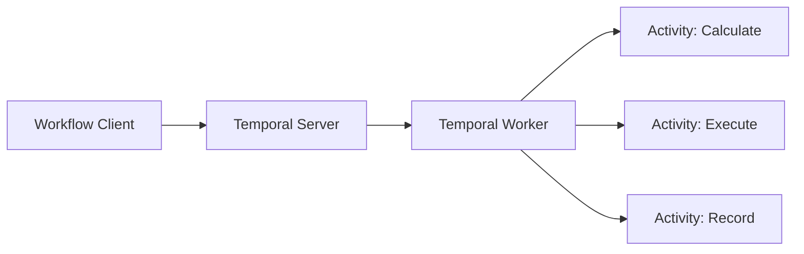

**Benefits**:

- **Durability**: Workflows survive crashes
- **Observability**: Full execution history
- **Retries**: Automatic retry with exponential backoff
- **Testing**: Replay and time-travel debugging

---

#### 7. Shovel Indexer (`/packages/shovel`)

**Purpose**: Index blockchain events into PostgreSQL

**How It Works**:

1. Listens to Base chain events
2. Filters relevant contract events (transfers, registrations)
3. Transforms event data
4. Writes to Supabase database

**Configuration**:

```yaml
# shovel.yaml
chains:
  - name: base
    rpc: https://mainnet.base.org

contracts:
  - address: '0x...'
    abi: SendAccount
    events:
      - Transfer
      - SendtagRegistered

sinks:
  - type: postgres
    connection: postgresql://...
```

**Benefits**:

- Fast queries without RPC calls
- Historical data analysis
- Real-time activity feed updates
- Reduced blockchain API costs

---

### Blockchain Layer

#### 8. Base Chain

**Purpose**: Layer 2 Ethereum network for low-cost transactions

**Characteristics**:

- Optimistic Rollup architecture
- EVM-compatible
- ~2 second block times
- Significantly lower gas fees than Ethereum L1

**Network Information**:

- Mainnet Chain ID: 8453
- RPC: https://mainnet.base.org
- Block Explorer: https://basescan.org

---

#### 9. ERC-4337/7677 Bundler

**Purpose**: Process UserOperations for account abstraction

**Implementation**:

- ERC-4337/7677 compliant bundler client
- Compatible with multiple providers (Coinbase CDP, Pimlico, etc.)
- Configurable via environment variables (BUNDLER_RPC_URL, ERC7677_BUNDLER_RPC_URL)
- EntryPoint v0.7 support

**Flow**:

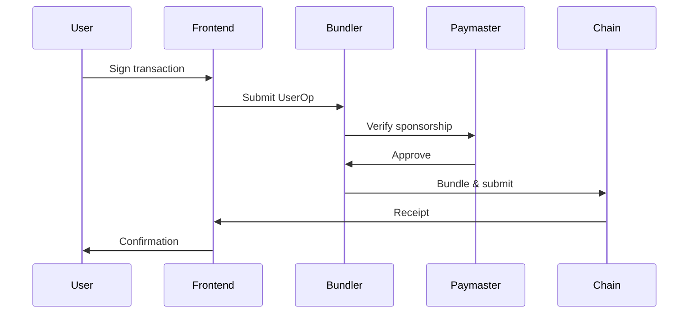

**Benefits**:

- Gasless transactions (paymaster sponsorship)
- Batch operations
- Custom validation logic
- Improved UX (no ETH required for gas)
- Provider flexibility (not locked to single vendor)

---

#### 10. Smart Contracts (`/packages/contracts`)

##### SendAccount (ERC-4337)

**Purpose**: Smart contract wallet for each user

**Features**:

- ERC-4337 compliant account abstraction
- WebAuthn signature verification
- Multi-sig recovery
- Gasless transaction support

**Key Functions**:

```solidity
contract SendAccount {
    function validateUserOp(
        UserOperation calldata userOp,
        bytes32 userOpHash,
        uint256 missingAccountFunds
    ) external returns (uint256 validationData);

    function execute(
        address dest,
        uint256 value,
        bytes calldata func
    ) external;

    function executeBatch(
        address[] calldata dest,
        uint256[] calldata value,
        bytes[] calldata func
    ) external;
}
```

##### SendVerifier

**Purpose**: Verify WebAuthn signatures on-chain

**Features**:

- P256 signature verification
- FIDO2 authenticator data parsing
- Gas-optimized verification logic

##### TokenPaymaster

**Purpose**: Sponsor gas fees for user transactions

**Features**:

- ERC-20 token payment for gas
- Sponsorship for specific operations
- Usage limits and rate limiting

##### SendtagCheckout

**Purpose**: Purchase and register sendtags

**Features**:

- ERC20 token payments (USDC, SEND, etc.)
- Payments sent to Send Multisig
- Referrer commission remittance
- Pausable contract for emergency stops
- Owner-controlled fund withdrawals

**Deployment Architecture**:

```
Foundry Project
├── src/
│   ├── SendAccount.sol
│   ├── SendVerifier.sol
│   ├── TokenPaymaster.sol
│   └── SendtagCheckout.sol
├── test/
│   └── *.t.sol (Foundry tests)
└── script/
    └── Deploy.s.sol (deployment scripts)
```

---

## Integration Patterns

### Frontend ↔ Backend

#### Authentication Flow

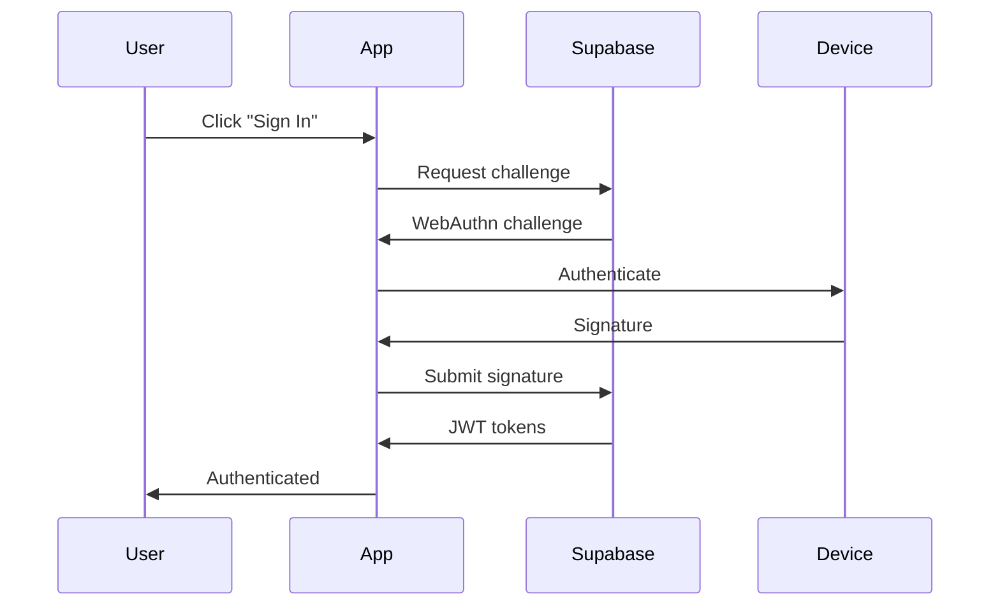

#### Data Fetching (tRPC)

```typescript
// Backend: tRPC router
export const appRouter = router({
  getBalance: publicProcedure.input(z.object({ address: z.string() })).query(async ({ input }) => {
    return await getTokenBalance(input.address)
  }),
})

// Frontend: tRPC client
const { data: balance } = trpc.getBalance.useQuery({
  address: userAddress,
})
```

---

### Frontend ↔ Blockchain

#### Transaction Flow

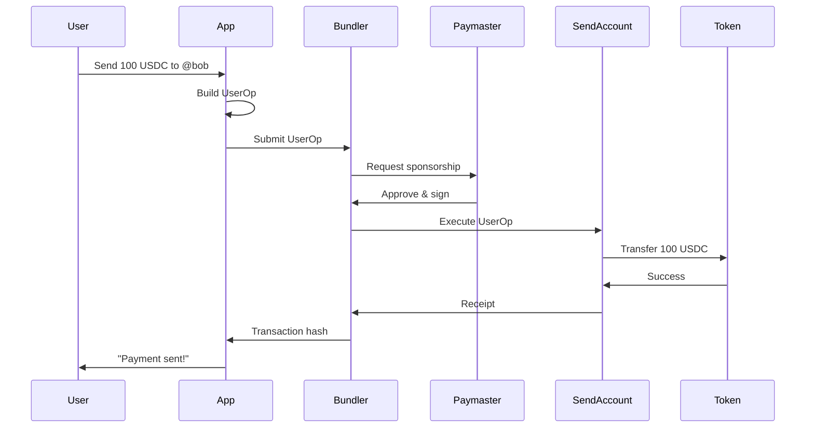

#### Smart Contract Interaction (Wagmi)

```typescript
import { useSendAccount } from '@my/wagmi'

export function SendButton() {
  const { write, isLoading } = useSendAccount({
    onSuccess: (data) => {
      console.log('Transaction:', data.hash)
    }
  })

  return (
    <Button
      disabled={isLoading}
      onPress={() => write({
        functionName: 'execute',
        args: [recipient, amount, tokenAddress]
      })}
    >
      Send Payment
    </Button>
  )
}
```

---

### Backend ↔ Blockchain

#### Event Indexing (Shovel)

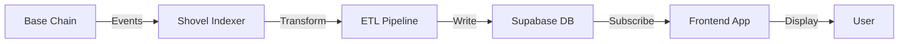

#### Smart Contract Calls (Distributor)

```typescript
import { createPublicClient, createWalletClient } from 'viem'

// Read contract state
const balance = await publicClient.readContract({
  address: tokenAddress,
  abi: ERC20_ABI,
  functionName: 'balanceOf',
  args: [userAddress],
})

// Write transaction
const hash = await walletClient.writeContract({
  address: tokenAddress,
  abi: ERC20_ABI,
  functionName: 'transfer',
  args: [recipient, amount],
})
```

---

## Data Flow Diagrams

### User Registration Flow

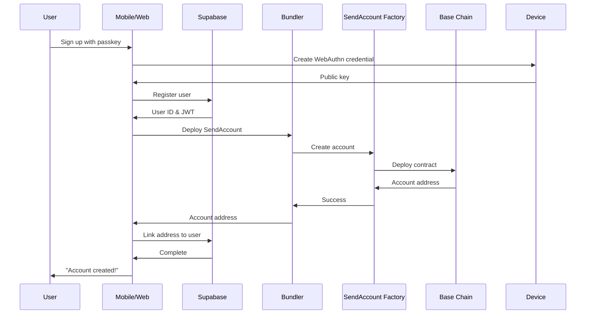

### Payment Flow

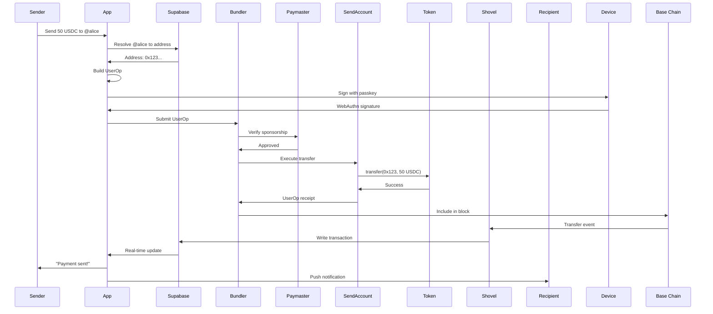

### Sendtag Purchase Flow

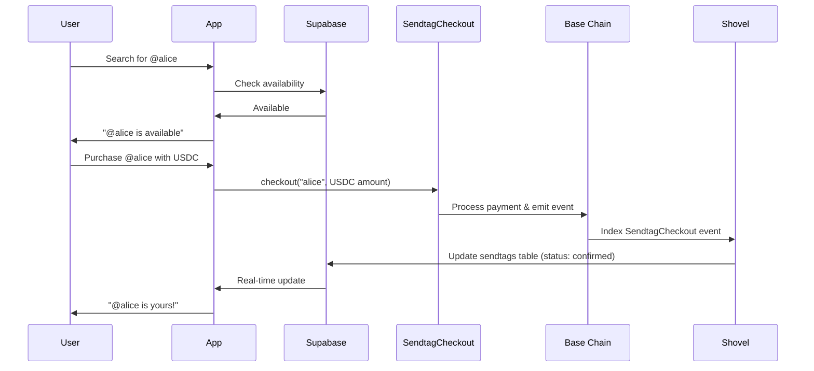

---

## Deployment Architecture

### Production Environment

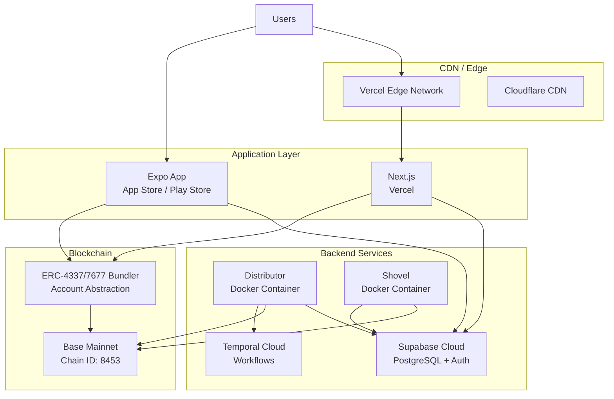

### Infrastructure Components

#### Web Application

- **Platform**: Vercel
- **Deployment**: Automatic via GitHub integration
- **Domains**: send.app, support.send.app
- **Features**: Edge functions, CDN, automatic HTTPS

#### Mobile Application

- **Platform**: Expo EAS (Expo Application Services)
- **Distribution**: Apple App Store, Google Play Store
- **OTA Updates**: Expo Updates for JS bundle updates
- **Build**: Cloud builds via EAS Build

#### Backend Services

- **Container Orchestration**: Docker + Kubernetes (or similar)
- **Database**: Supabase Cloud (or self-hosted)
- **Secrets Management**: Environment variables, encrypted secrets
- **Monitoring**: Datadog, Sentry, or similar

#### Blockchain

- **Network**: Base Mainnet (Chain ID: 8453)
- **RPC Providers**: Alchemy, Infura, or self-hosted nodes
- **Bundler**: Alchemy AA bundler or Pimlico
- **Contracts**: Deployed via Foundry scripts, verified on BaseScan

---

## Security Architecture

### Authentication Layers

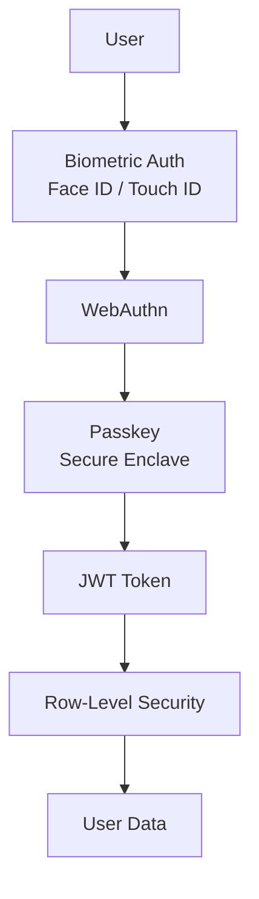

### Authorization Model

- **Database**: PostgreSQL Row-Level Security policies
- **API**: JWT validation on all protected endpoints
- **Smart Contracts**: Role-based access control (OpenZeppelin)
- **Frontend**: Conditional rendering based on auth state

### Data Protection

- **Encryption in Transit**: TLS 1.3 for all connections
- **Encryption at Rest**: Database encryption, encrypted backups
- **Key Management**: Device secure enclaves, KMS for server keys
- **Audit Logs**: Comprehensive logging of sensitive operations

---

## Open Source Philosophy

**Send is fully open source**, promoting:

- **Transparency**: All code publicly auditable
- **Security**: Community security reviews and audits
- **Collaboration**: External contributors welcome
- **Self-Hosting**: Organizations can deploy their own instance
- **Customization**: Fork and modify for specific use cases

**Contributing**:

- GitHub repository: [github.com/0xsend/sendapp](https://github.com/0xsend/sendapp)
- Issues and PRs welcome
- Documentation for contributors in `/docs`
