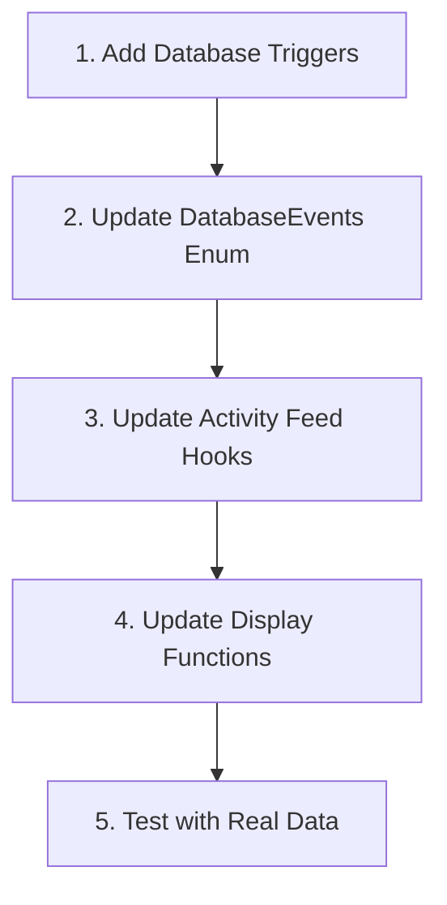

# Send Earn: Activity Feed & Affiliate Reward Claim Fix

## Problem Statement

We found that affiliates are unable to see their deposits after claiming rewards. This is due to the claim transaction not being included in the `send_account_transfers` event table. We need to add triggers to the `send_earn_deposit` and `send_earn_withdraw` tables to include these events in the activity feed.

Previously, the send earn activity was accomplished using virtual events. For now, we need to roll that back, we can keep the processing in place for future virtual events.

Then, we need to expand the filtering logic to ensure we do not show duplicate events in the activity feeds. This is because when a user deposits into a Send Earn vault, the deposit shows as a `send_account_transfers` event since it uses an erc20 transfer to the vault when depositing.

## Implementation Plan

### 1. Database Layer Changes

#### 1.1. Create Triggers for Send Earn Deposits and Withdrawals

We need to create database triggers that follow the **same pattern** as the existing `send_account_transfers_trigger_insert_activity`. This is the key fix needed.

```sql
-- Trigger function for send_earn_deposit
CREATE OR REPLACE FUNCTION private.send_earn_deposit_trigger_insert_activity()
RETURNS TRIGGER
LANGUAGE plpgsql
SECURITY DEFINER
AS $$
DECLARE
    _owner_user_id uuid;
    _data jsonb;
BEGIN
    -- Select send app info for owner address (the Send account owner)
    SELECT user_id INTO _owner_user_id
    FROM send_accounts
    WHERE address = concat('0x', encode(NEW.owner, 'hex'))::citext;

    -- Build data object with the same pattern as send_account_transfers
    -- Cast numeric values to text to avoid losing precision
    _data := json_build_object(
        'log_addr', NEW.log_addr,
        'f', NEW.sender,
        't', NEW.log_addr,
        'owner', NEW.owner,
        'v', NEW.assets::text,
        'shares', NEW.shares::text,
        'tx_hash', NEW.tx_hash,
        'block_num', NEW.block_num::text,
        'tx_idx', NEW.tx_idx::text,
        'log_idx', NEW.log_idx::text
    );

    -- Insert into activity table - notice the similar pattern to send_account_transfers
    INSERT INTO activity (event_name, event_id, from_user_id, to_user_id, data, created_at)
    VALUES (
        'send_earn_deposit',
        NEW.event_id,
        _owner_user_id,  -- In this case from_user is the owner
        NULL,            -- No to_user for deposits
        _data,
        to_timestamp(NEW.block_time) at time zone 'UTC'
    )
    ON CONFLICT (event_name, event_id) DO UPDATE SET
        from_user_id = _owner_user_id,
        data = _data,
        created_at = to_timestamp(NEW.block_time) at time zone 'UTC';

    RETURN NEW;
END;
$$;

-- Create trigger on send_earn_deposit table
CREATE TRIGGER send_earn_deposit_trigger_insert_activity
AFTER INSERT ON public.send_earn_deposit
FOR EACH ROW
EXECUTE FUNCTION private.send_earn_deposit_trigger_insert_activity();

-- Trigger function for send_earn_withdraw
CREATE OR REPLACE FUNCTION private.send_earn_withdraw_trigger_insert_activity()
RETURNS TRIGGER
LANGUAGE plpgsql
SECURITY DEFINER
AS $$
DECLARE
    _owner_user_id uuid;
    _data jsonb;
BEGIN
    -- Select send app info for owner address
    SELECT user_id INTO _owner_user_id
    FROM send_accounts
    WHERE address = concat('0x', encode(NEW.owner, 'hex'))::citext;

    -- Build data object with the same pattern as send_account_transfers
    _data := json_build_object(
        'log_addr', NEW.log_addr,
        'f', NEW.log_addr,
        't', NEW.receiver,
        'owner', NEW.owner,
        'v', NEW.assets::text,
        'shares', NEW.shares::text,
        'tx_hash', NEW.tx_hash,
        'block_num', NEW.block_num::text,
        'tx_idx', NEW.tx_idx::text,
        'log_idx', NEW.log_idx::text
    );

    -- Insert into activity table with the same pattern
    INSERT INTO activity (event_name, event_id, from_user_id, to_user_id, data, created_at)
    VALUES (
        'send_earn_withdraw',
        NEW.event_id,
        _owner_user_id,  -- In this case from_user is the owner
        NULL,            -- No to_user for withdrawals
        _data,
        to_timestamp(NEW.block_time) at time zone 'UTC'
    )
    ON CONFLICT (event_name, event_id) DO UPDATE SET
        from_user_id = _owner_user_id,
        data = _data,
        created_at = to_timestamp(NEW.block_time) at time zone 'UTC';

    RETURN NEW;
END;
$$;

-- Create trigger on send_earn_withdraw table
CREATE TRIGGER send_earn_withdraw_trigger_insert_activity
AFTER INSERT ON public.send_earn_withdraw
FOR EACH ROW
EXECUTE FUNCTION private.send_earn_withdraw_trigger_insert_activity();

-- Also add delete triggers to maintain consistency
CREATE OR REPLACE FUNCTION private.send_earn_deposit_trigger_delete_activity()
RETURNS TRIGGER
LANGUAGE plpgsql
SECURITY DEFINER
AS $$
BEGIN
    DELETE FROM activity
    WHERE event_id = OLD.event_id
        AND event_name = 'send_earn_deposit';
    RETURN OLD;
END;
$$;

CREATE TRIGGER send_earn_deposit_trigger_delete_activity
AFTER DELETE ON public.send_earn_deposit
FOR EACH ROW
EXECUTE FUNCTION private.send_earn_deposit_trigger_delete_activity();

CREATE OR REPLACE FUNCTION private.send_earn_withdraw_trigger_delete_activity()
RETURNS TRIGGER
LANGUAGE plpgsql
SECURITY DEFINER
AS $$
BEGIN
    DELETE FROM activity
    WHERE event_id = OLD.event_id
        AND event_name = 'send_earn_withdraw';
    RETURN OLD;
END;
$$;

CREATE TRIGGER send_earn_withdraw_trigger_delete_activity
AFTER DELETE ON public.send_earn_withdraw
FOR EACH ROW
EXECUTE FUNCTION private.send_earn_withdraw_trigger_delete_activity();
```

### 2. Client-Side Updates

#### 2.1. Update Database Events Enum

Add the new database events to the `DatabaseEvents` enum:

```typescript
/**
 * Database events that can be found in the activity feed.
 * These are the actual event_name values from the database.
 */
export enum DatabaseEvents {
  // Existing events...
  SendAccountTransfers = 'send_account_transfers',
  TagReceipts = 'tag_receipts',
  TagReceiptUSDC = 'tag_receipt_usdc',
  Referrals = 'referrals',
  SendAccountReceive = 'send_account_receives',

  // New events
  SendEarnDeposits = 'send_earn_deposit',
  SendEarnWithdraws = 'send_earn_withdraw',
}
```

#### 2.2. Update Activity Feed Hooks

The key improvement is how we handle filtering in the activity feed:

```typescript
// In useEarnActivityFeed.ts
import { DatabaseEvents } from '../utils/zod/activity/events';

export function useEarnActivityFeed() {
  const { userAddressBytea, vaultAddresses } = useEarnContext();

  // Create a comma-separated list of vault addresses for the SQL query
  const vaultAddressesValues = vaultAddresses.length > 0
    ? vaultAddresses.map(a => `'${a}'`).join(',')
    : "''"; // Empty string if no vaults to prevent SQL error

  const query = supabase
    .from('activity_feed')
    .select('*')
    .or(
      squish(`
        event_name.eq.${DatabaseEvents.SendEarnDeposits},data->>owner.eq.${userAddressBytea},
        event_name.eq.${DatabaseEvents.SendEarnWithdraws},data->>owner.eq.${userAddressBytea}
      `)
    )
    .order('created_at', { ascending: false });

  // Execute the query and handle response...
}
```

#### 2.3. Update Display Functions

Update the event display functions to handle the new database events:

```typescript
export function eventNameFromActivity(activity: Activity) {
  const { event_name, from_user, to_user, data } = activity;

  switch (true) {
    // Database events for Send Earn
    case event_name === DatabaseEvents.SendEarnDeposits:
      return 'Send Earn Deposit';
    case event_name === DatabaseEvents.SendEarnWithdraws:
      return 'Send Earn Withdraw';

    // Other existing cases...
  }
}

export function phraseFromActivity(activity: Activity) {
  const { event_name, from_user, to_user, data } = activity;

  switch (true) {
    // Database events for Send Earn
    case event_name === DatabaseEvents.SendEarnDeposits:
      return 'Deposited to Send Earn';
    case event_name === DatabaseEvents.SendEarnWithdraws:
      return 'Withdrew from Send Earn';

    // Other existing cases...
  }
}
```

### 3. Migration Strategy

1. First, implement the database triggers to start capturing Send Earn events directly in the activity feed.
2. Update the client-side code to handle the new events.
3. Keep the virtual event processing capabilities in place, but remove the send earn virtual event rules.

### 4. Implementation Flow



### 5. Testing Strategy

1. **Database Tests**:
   - Test that insert/delete triggers work correctly
   - Verify event data is correctly formatted in activity table
   - Check user_id associations

2. **Integration Tests**:
   - Test the full flow from database to UI
   - Ensure proper displaying of both deposit and withdrawal events
   - Verify that affiliates can see their deposits after claiming rewards

3. **Manual Testing Scenarios**:
   - Affiliate creates a new deposit
   - Affiliate claims rewards
   - Verify the deposit appears in the activity feed

## Relevant Files

- `/docs/activity-feed.md`
- `/docs/activity-feed-client-processing.md`
- `packages/app/utils/activity.ts`
- `packages/app/utils/zod/activity/events.ts`
- `packages/app/features/activity/utils/useActivityFeed.ts`
- `packages/app/features/earn/utils/useEarnActivityFeed.ts`
- `packages/app/features/home/utils/useTokenActivityFeed.ts`
- `supabase/migrations/20250312152454_send_earn.sql`
