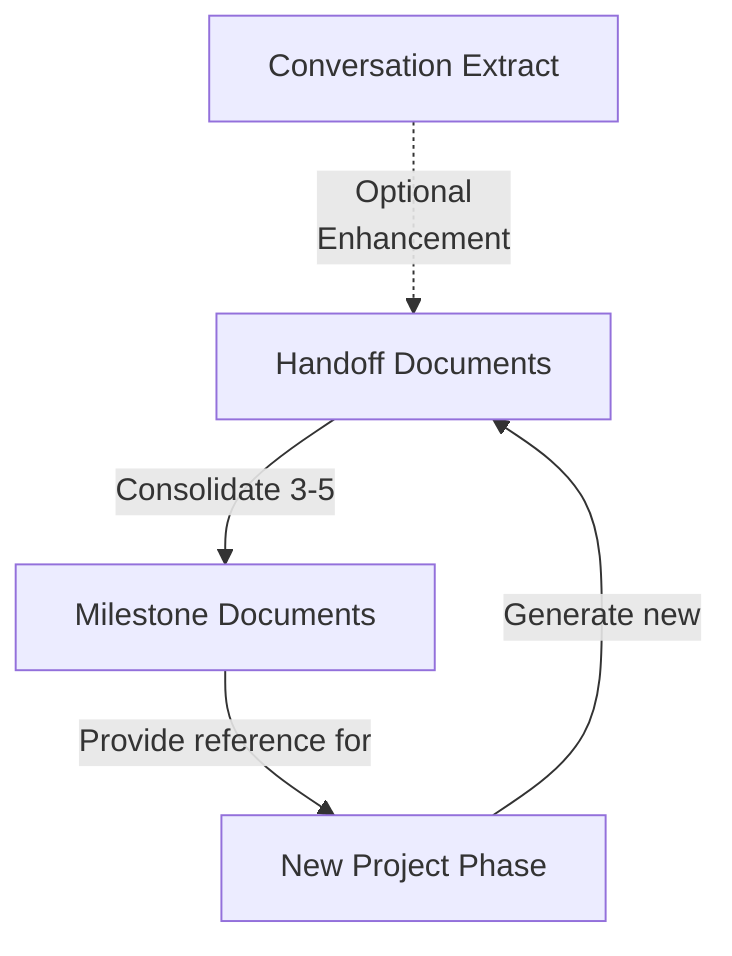
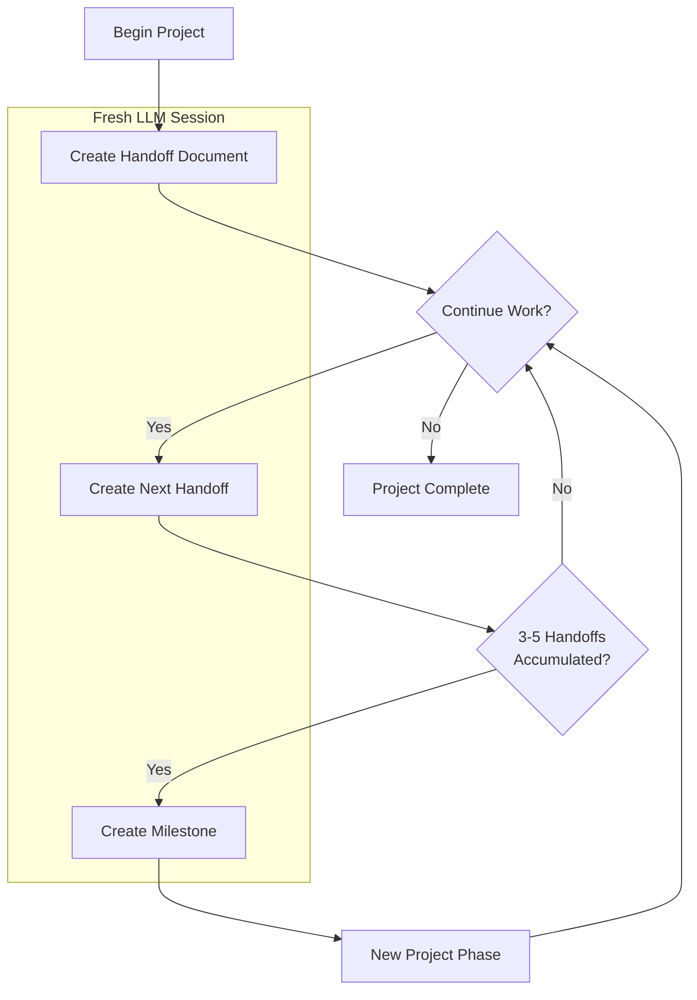

# Handoff Manager System

## Core Concept

The Handoff Manager provides structured workflows for maintaining optimal context between LLM sessions through:

1. **Handoffs**: Sequential session reports capturing completed work
2. **Milestones**: Consolidated knowledge from multiple handoffs 
3. **Conversation Extraction**: Optional analysis of conversation history



## Workflow-Guided Process

The Handoff Manager follows clear workflow diagrams for each operation:

1. **Creation Workflow**: Guides handoff and milestone creation decisions
2. **Restoration Workflow**: Optimizes context loading from existing documents

## Documents Structure

**Handoffs**:
- Numbered sequentially (1-setup.md, 2-implementation.md)
- Located in handoffs/ root directory
- Contain specific completed work details
- Enhanced with conversation extracts when available

**Milestones**:
- Stored in numbered folders (1-feature-complete/)
- Consolidate multiple handoff documents
- Summarize achievements and lessons learned

## Creation Triggers

**Create handoff documents when**:
- Completing a significant project segment
- Context becomes ~30% irrelevant to current task
- After 10+ conversation exchanges
- During debugging sessions exceeding 5 exchanges without resolution

**Create milestone documents when**:
- Major feature/component implementation complete
- Project phase completed
- 3-5 handoffs accumulated since last milestone
- Critical problem solved with valuable lessons
- Project reaches stable/deployable state

## Context Assessment Process

Before each major response:
1. Review context window contents:
   - Most relevant: current task, recent files, active discussions
   - Moderately relevant: background information, earlier work
   - Low relevance: initial setup, tangential discussions
2. Determine if handoff needed based on assessment

## Implementation

To implement the Handoff Manager system:

1. Install the system files in your project:
   - Copy `.roomodes` file to project root
   - Copy `.clinerules` file to project root
   - Create handoffs/ directory structure

2. Use the handoff-manager mode for all operations:
   ```
   I need to create a handoff document for our current work. Please follow the handoff creation workflow.
   ```

3. Optional: Use conversation extraction to enhance handoffs
   ```
   python handoffs/chat_history/extract_conversation.py conversation.md extracted_conversation.md
   ```

## Compatibility

- Optimized for all Claude 3 models
- Works with all Anthropic models supporting Markdown and Mermaid diagrams

## Process Flow



## Reference Documentation

- [1-handoff-instructions.md](./1-handoff-instructions.md): Handoff document format
- [2-milestone-instructions.md](./2-milestone-instructions.md): Milestone process
- [3-milestone-scripts.md](./3-milestone-scripts.md): Automation scripts
- [Prompts](./prompts/): Templates for common operations