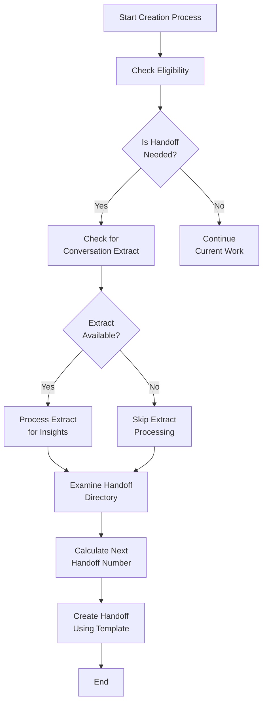
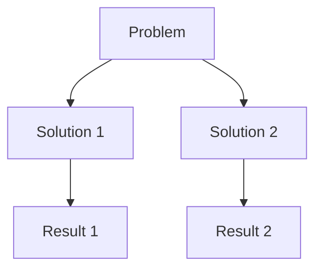

# Handoff Document Creation Guidelines

## Purpose

A handoff document is a structured report that captures your development session for future reference. It focuses on **what happened** rather than general instructions, documenting events and learnings not recorded elsewhere.

## Information Sources

| Source | Description | Usage |
|--------|-------------|-------|
| **Memory** | Previous prompts and responses | Review conversation history |
| **Conversation** | Extracted insights from discussion | Use conversation extraction tools |
| **Project Context** | Project files and documentation | Reference relevant files |

## Handoff Creation Workflow

The handoff-manager follows this workflow when creating handoff documents:



## Document Template

```markdown
# [TOPIC] Handoff - [DATE]

## Summary
[2-3 sentence overview]

## Priority Development Requirements (PDR)
- **HIGH**: [Must address immediately]
- **MEDIUM**: [Address soon]
- **LOW**: [Be aware]

## Discoveries
- [Unexpected finding 1]
- [Unexpected finding 2]

## Problems & Solutions
- **Problem**: [Issue description]
  **Solution**: [Solution applied]
  ```code example if needed```

## Work in Progress
- [Task 1]: [Progress %]
- [Task 2]: [Progress %]

## Deviations
- [Changed X to Y because Z]

## References
- [doc/path1]
- [doc/path2]
```

## Required Sections

| Section | Purpose | Content Tips |
|---------|---------|-------------|
| **Date** | Chronological reference | Use ISO format: YYYY-MM-DD |
| **Summary** | Brief overview | 2-3 sentences covering key achievements |
| **PDR** | Prioritized tasks | Label as HIGH/MEDIUM/LOW |
| **Discoveries** | Unexpected findings | Focus on surprises and insights |
| **Problems & Solutions** | Issue resolution | Pair each problem with its solution |
| **Work in Progress** | Ongoing tasks | Include completion percentage estimates |
| **Deviations** | Plan changes | Explain why changes were made |
| **References** | Related files | Include paths to relevant files |

## Technical Guidelines

### Do Include

- **Necessary Details**: Technical information needed to understand the state
- **Targeted Code**: Snippets that illustrate solutions (not entire files)
- **Actionable Information**: What the next developer needs to continue work
- **Exact Error Messages**: For bugs, include the precise error text
- **Conversation Insights**: When available, incorporate analysis from conversation extracts

### Don't Include

- **Already Documented**: Information in READMEs or other documentation
- **How-to Information**: Standard procedures already documented elsewhere
- **General Context**: Basic explanations that are widely known
- **Unnecessary Files**: Full file contents unless absolutely essential

## Naming and Structure

1. **Sequential Numbering**: Use format `N-descriptive-name.md` (e.g., `4-database-refactoring.md`)
2. **No Zero Prefixes**: Reserve 0-prefixed files for milestone documents
3. **Descriptive Names**: Brief but meaningful description after the number
4. **Root Location**: Place directly in handoffs/ directory, not in subdirectories

## Visual Elements

Use Mermaid diagrams for complex workflows or relationships:



## Good vs. Poor Examples

#### ❌ Poor: General information without specifics

```
The auth system uses JWT tokens with 24h expiry.
```

#### ✅ Good: Specific issue, solution, and timestamp

```
[2025-02-25] Login failures caused by timezone in token validation. Fixed with UTC standardization.
```

## Conversation Extract Integration

When using conversation extracts:

1. Review the extracted insights for:
   - Key discoveries made during the conversation
   - Problems encountered and solutions applied
   - Decision points and rationales
   - Work completed or in progress

2. Incorporate these insights into your handoff document
3. Verify and edit the information for accuracy
4. Reference the conversation extract in your References section

> **Remember**: A handoff is about passing the baton - focus on information that isn't obvious from existing documentation and would be valuable to the next developer.