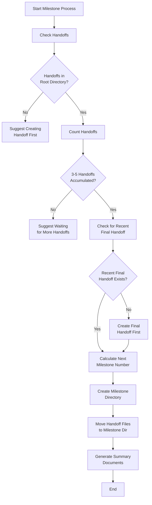
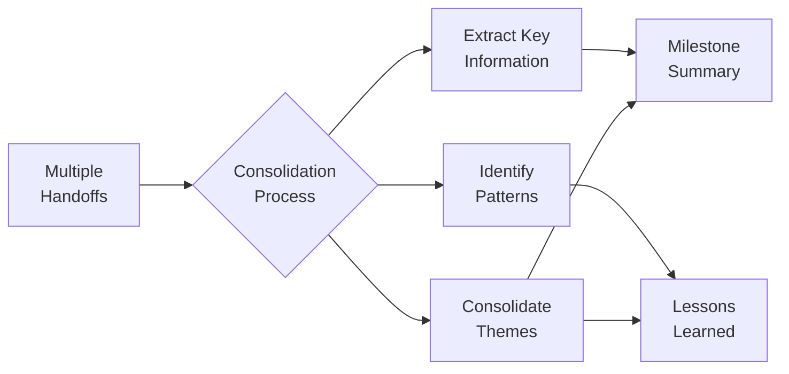

# Milestone Creation Guidelines

## Purpose

Milestones consolidate knowledge from multiple handoffs into a high-level summary. Create milestones when:
- Major component is completed
- Critical bug is fixed
- Implementation approach has changed
- Feature has been delivered
- 3-5 handoffs have accumulated

## Milestone Creation Workflow

The handoff-manager follows this workflow when creating milestone documents:



## Core Principles

| Principle | Description | Example |
|-----------|-------------|---------|
| **Concise** | Every token counts; be brief | "Query optimized: 30x faster" |
| **Factual** | Concrete details, not stories | "Cache hit rate: 94.6%" |
| **Relevant** | Include only essential information | Focus on reusable patterns |
| **Future-Focused** | What next developers need | Document API assumptions |
| **Learning-Oriented** | Document issues and solutions | Pattern: "Problem → Solution" |

## From Handoffs to Milestone

### 1. Source Material: Handoffs

- Sequential handoff documents in handoffs/ directory
- Numbered without "0-" prefix (1-setup.md, 2-entities.md)
- Detail-rich documentation of individual development sessions

### 2. Consolidation Process



- **Extract key information** from all handoffs
- **Identify patterns** across multiple handoffs
- **Consolidate repeated themes** into general principles
- **Transform details** into concise, factual statements
- **Prioritize information** with long-term value

## Required Files

### 1. 0-milestone-summary.md

```markdown
# [Project/Feature] Milestone Summary - [DATE]

## Changes Implemented
- [Major change 1]
- [Major change 2]
- [Major change 3]

## Key Decisions
- [Decision 1]: [Rationale]
- [Decision 2]: [Rationale]
- [Decision 3]: [Rationale]

## Discoveries
- [Important finding 1]
- [Important finding 2]
- [Important finding 3]

## Current System State
- [Component 1]: [Status]
- [Component 2]: [Status]
- [Component 3]: [Status]
```

### 2. 0-lessons-learned.md

```markdown
# Lessons Learned - [Feature/Component]

## [Problem Category 1]

**Problem:** [Issue description]

**Solution:**
- [Solution step 1]
- [Solution step 2]
- [Solution step 3]

## [Problem Category 2]

**Problem:** [Issue description]

**Solution:**
- [Implementation details]
- [Code patterns to use]
- [Testing approach]

## Tools and Libraries

- [Tool/Library 1]: [Usage and value]
- [Tool/Library 2]: [Usage and value]

## Edge Cases

- [Edge case 1]: [Handling approach]
- [Edge case 2]: [Handling approach]
```

## Directory Organization

### Before Milestone Creation

```
handoffs/
├── 1-api-setup.md
├── 2-core-entities-implementation.md
├── 3-relationship-fixes.md
└── ... (other files and directories)
```

### After Milestone Creation

```
handoffs/
├── 1-core-entities/              # Milestone directory
│   ├── 0-milestone-summary.md    # High-level summary
│   ├── 0-lessons-learned.md      # Reusable patterns and solutions
│   ├── 1-api-setup.md            # Original handoff (moved)
│   ├── 2-core-entities-implementation.md  # Original handoff (moved)
│   └── 3-relationship-fixes.md   # Original handoff (moved)
└── ... (next handoffs will start fresh)
```

## Naming Conventions

- **System files**: Prefix with "0-" (0-milestone-summary.md)
- **Handoffs**: Numbered without "0-" (1-setup.md)
- **Milestone directories**: Numbered without "0-" (1-feature-name)

## Content Writing Examples

### Effective Milestone Summary Entries

```markdown
## Changes
- Data connector with batch processing (3.5MB/s throughput)
- Query optimization: reduced lookup time 30x (8.2s → 0.27s)
- Cross-platform path handling for Windows/Linux compatibility

## Decisions
- Switched validation library: 40% faster processing, 62% smaller bundle
- Implemented nested environment variables for flexible configuration
- Added default fallbacks for missing reference data
```

### Effective Lessons Learned Entries

```markdown
## Configuration System Migration

**Problem:** `Cannot import Settings from legacy configuration library`

**Solution:**
- Update dependency to v3.2.1+ (earlier versions incompatible)
- Use new configuration pattern with dot notation
- Initialize with correct environment prefix
- Add validation schema using Zod

## Null Value Processing

**Problem:** `Invalid value in transformation pipeline: undefined reference`

**Solution:**
- Create data sanitization function to handle all input values
- Replace invalid/undefined values with explicit null
- Add type guards before serialization
- Implement validation at both API boundaries
```

## Script-Based Organization

For moving multiple handoff files, use the appropriate script from [3-milestone-scripts.md](./3-milestone-scripts.md):

- **Bash/PowerShell/Python/Node.js**: Scripts to create milestone directory and move handoff files
- Customize the milestone name in the script before running

> **Important**: Always create a final handoff documenting the most recent work before creating a milestone. This ensures the milestone captures the complete picture.