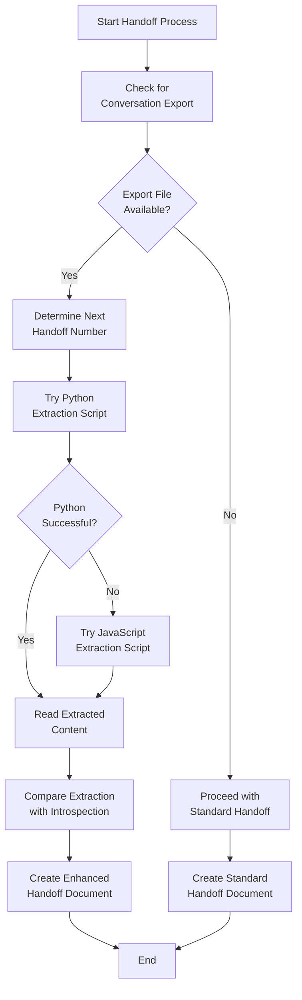

# Conversation Extraction Process

## Overview

This document explains how to integrate conversation extraction with handoff creation. Conversation extraction analyzes exported chat history to enhance handoffs with insights from the development discussion.

## Automated Extraction Workflow

When creating a handoff with conversation history:



## Step-by-Step Process

1. **Export Conversation**: User exports conversation from Roo-Code as `conversation.md`

2. **Script Execution**: The handoff-manager tries scripts in this order:
   ```
   # First try Python script
   python handoffs/chat_history/extract_conversation.py conversation.md handoffs/<handoff-#>-chat_transcript.md
   
   # If Python fails, try JavaScript
   node handoffs/chat_history/extract_conversation.js conversation.md handoffs/<handoff-#>-chat_transcript.md
   ```
   
   Where `<handoff-#>` is the next sequential handoff number (e.g., `4-chat_transcript.md`)

3. **Content Analysis**: The handoff-manager:
   - Reads the extracted transcript
   - Identifies key insights, problems/solutions, and decisions
   - Compares these with its own introspection of the conversation
   - Synthesizes both perspectives for a comprehensive understanding

4. **Handoff Creation**: Creates a handoff document incorporating:
   - Information from the extracted transcript
   - Direct introspection of the development process
   - Cross-referenced insights from both sources

## Usage Examples

### Basic Usage

```
I need to create a handoff document with conversation extraction. I've exported the conversation as conversation.md.
```

### Custom Naming

```
I need to create a handoff document focused on [TOPIC] with conversation extraction. I've exported the conversation as conversation.md.
```

## Script Fallback Logic

The handoff-manager follows this execution strategy:

1. **Primary Script**: Try the Python script first
   ```python
   python handoffs/chat_history/extract_conversation.py conversation.md handoffs/<handoff-#>-chat_transcript.md
   ```

2. **Error Detection**: If errors occur (non-zero exit code or error message), proceed to fallback

3. **Fallback Script**: Try the JavaScript version
   ```javascript
   node handoffs/chat_history/extract_conversation.js conversation.md handoffs/<handoff-#>-chat_transcript.md
   ```

4. **Final Handling**: If both fail, create handoff using only introspection and report script issues

## Integration with Introspection

The handoff-manager integrates extraction with introspection:

| Information Source | Strengths | Usage |
|-------------------|-----------|-------|
| **Extracted Transcript** | Captures textual details from conversation | Technical details, error messages, code snippets |
| **LLM Introspection** | Insights about reasoning and process | Decision rationale, problem understanding, conceptual insights |
| **Combined Analysis** | Complete picture of development process | Comprehensive handoff with both perspectives |

The handoff-manager cross-references these sources, noting areas of agreement and identifying any additional insights from either source.

## Output File Handling

The extracted content is saved following these conventions:

1. **Location**: Directly in the handoffs/ directory
2. **Naming**: `<handoff-#>-chat_transcript.md` where # is the next handoff number
3. **Referencing**: The file is referenced in the handoff's References section

## Error Handling

If script execution fails:

1. Report the specific error to the user
2. Provide troubleshooting guidance based on error type
3. Still create a handoff document using introspection only
4. Note in the handoff that conversation extraction was attempted but not available